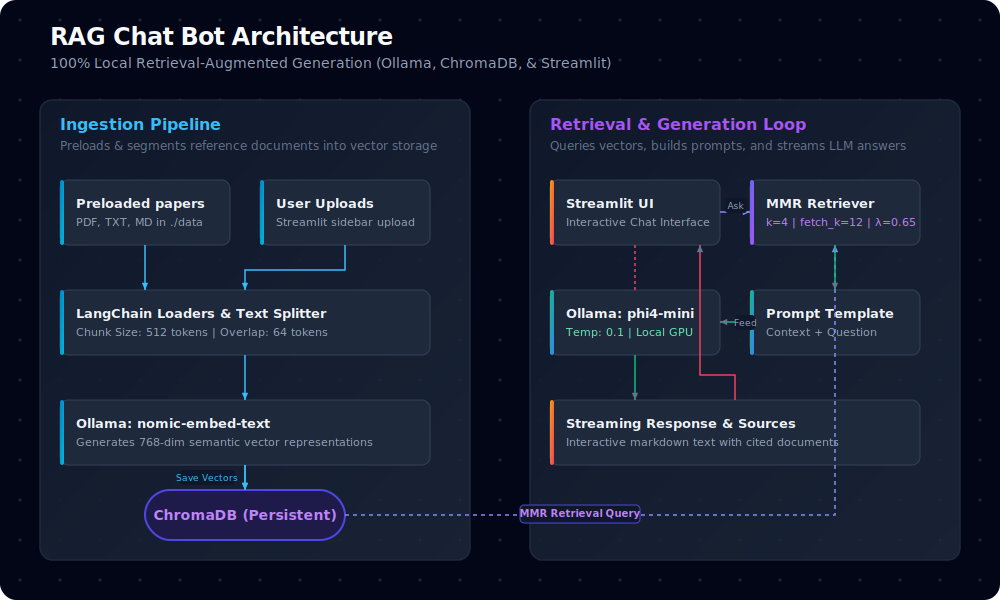

# RAG Chat Bot

A local, GPU-accelerated RAG (Retrieval-Augmented Generation) research assistant. Upload PDFs, TXT, or Markdown papers and ask questions — everything runs 100% locally via Ollama on AMD ROCm.

## Architecture



### Data Flow

1. **Ingestion**: Files are loaded from `./data` (preloaded) or `./uploads` (user-uploaded), split into 512-token chunks with 64-token overlap, embedded via `nomic-embed-text`, and stored in ChromaDB.
2. **Retrieval**: On a user query, ChromaDB performs MMR (Maximum Marginal Relevance) search — `fetch_k=12` candidates, `k=4` final results — balancing relevance and diversity.
3. **Generation**: Retrieved chunks are formatted into a prompt alongside the question. `phi4-mini` (4K context, 0.1 temperature) generates a streaming answer citing sources.
4. **Caching**: The ChromaDB handle is cached in memory after first load; invalidated automatically on any write (ingest/clear).

## Features

- **Local & Private**: Everything runs on your machine via Ollama — no data leaves your computer.
- **GPU Accelerated**: AMD ROCm support (RDNA2/gfx1034) with HSA override.
- **Streaming Responses**: LLM output streams token-by-token in the UI.
- **MMR Retrieval**: Balances relevance and diversity in retrieved chunks.
- **Dual Source Management**: Preloaded papers + user uploads, kept separate with per-source filtering.
- **Source Citations**: Each answer shows which documents/pages were used.
- **Full Context Display**: View the exact retrieved chunk text the LLM received.
- **Dark Mode UI**: Rich Streamlit interface with gradient backgrounds and card-based layout.

## Tech Stack

| Component         | Technology                            |
|-------------------|---------------------------------------|
| **UI**            | Streamlit                             |
| **LLM**           | phi4-mini (via Ollama)                |
| **Embeddings**    | nomic-embed-text (via Ollama)         |
| **Vector Store**  | ChromaDB (persistent)                 |
| **Retrieval**     | MMR (k=4, fetch_k=12, lambda=0.65)   |
| **Document Loaders** | LangChain (PyPDF, Text, Markdown) |
| **GPU Backend**   | AMD ROCm (gfx1034 / RDNA2)           |

## Installation

### Prerequisites

- Python 3.10+
- [Ollama](https://ollama.ai) installed and running
- Required Ollama models:
  ```bash
  ollama pull phi4-mini
  ollama pull nomic-embed-text
  ```
- AMD GPU with ROCm support (optional but recommended)

### Setup

```bash
# Clone the repository
git clone <repo-url> && cd rag-chat-bot

# Create virtual environment
python3 -m venv myvenv
source myvenv/bin/activate

# Install dependencies
pip install -r requirements.txt

# Run the app
streamlit run app.py
```

## Usage

1. **Preloaded papers**: Place PDFs/TXT/MD files in `./data/`. The app auto-ingests them on startup.
2. **Upload papers**: Use the sidebar file uploader to add your own documents.
3. **Ask questions**: Type your question in the chat input at the bottom.
4. **Filter sources**: Use the sidebar radio to search all, preloaded-only, or uploads-only.
5. **View context**: Expand "📖 Retrieved Context" to see the exact chunks used.
6. **Manage**: Re-ingest preloaded papers or clear uploads with sidebar buttons.

## Configuration

Edit `engine.py` constants:

| Constant        | Default  | Description                        |
|-----------------|----------|------------------------------------|
| `CHUNK_SIZE`    | 512      | Token chunk size for splitting     |
| `CHUNK_OVERLAP` | 64       | Overlap between adjacent chunks    |
| `RETRIEVER_K`   | 4        | Number of final chunks retrieved   |
| `FETCH_K`       | 12       | MMR candidate pool size            |
| `MMR_LAMBDA`    | 0.65     | 0=max diversity, 1=max relevance   |
| `EMBED_MODEL`   | nomic-embed-text | Ollama embedding model name |
| `LLM_MODEL`     | phi4-mini | Ollama generation model name      |

## Project Structure

```
.
├── app.py          # Streamlit UI — chat, uploads, settings
├── engine.py       # RAG engine — ingestion, retrieval, generation
├── data/           # Preloaded research papers (auto-ingested)
├── uploads/        # User-uploaded papers
├── chroma_db/      # Persistent ChromaDB vector store
├── myvenv/         # Python virtual environment
└── requirements.txt
```

## Linting & Type Checking

```bash
# Install dev dependencies
pip install ruff mypy pytest

# Lint
ruff check engine.py app.py

# Format
ruff format engine.py app.py

# Type check
mypy engine.py app.py

# Tests
pytest
```
